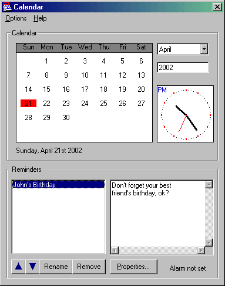



## Super Calendar

### Description

This program is a calendar. You may set reminders that will be activated at a certain hour. This reminders can be daily, weekly, etc.

It does not use any ActiveX control or DLL. Everything is calculated using math. This new version has many bugs fixed and a better performance.
 
### More Info
 

             |
---                |---
**Submitted On**   |2002-04-22 22:23:28
**By**             |[Paul Guerra](https://github.com/Planet-Source-Code/PSCIndex/blob/master/ByAuthor/paul-guerra.md)
**Level**          |Intermediate
**User Rating**    |4.3 (26 globes from 6 users)
**Compatibility**  |VB 5\.0, VB 6\.0
**Category**       |[Complete Applications](https://github.com/Planet-Source-Code/PSCIndex/blob/master/ByCategory/complete-applications__1-27.md)
**World**          |[Visual Basic](https://github.com/Planet-Source-Code/PSCIndex/blob/master/ByWorld/visual-basic.md)
**Archive File**   |[Super\_Cale750974232002\.zip](https://github.com/Planet-Source-Code/paul-guerra-super-calendar__1-25546/archive/master.zip)

